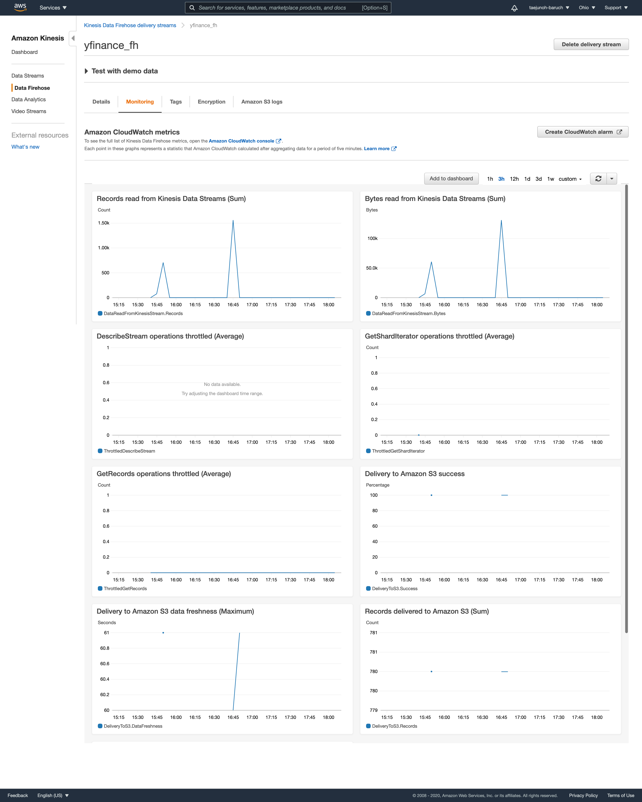
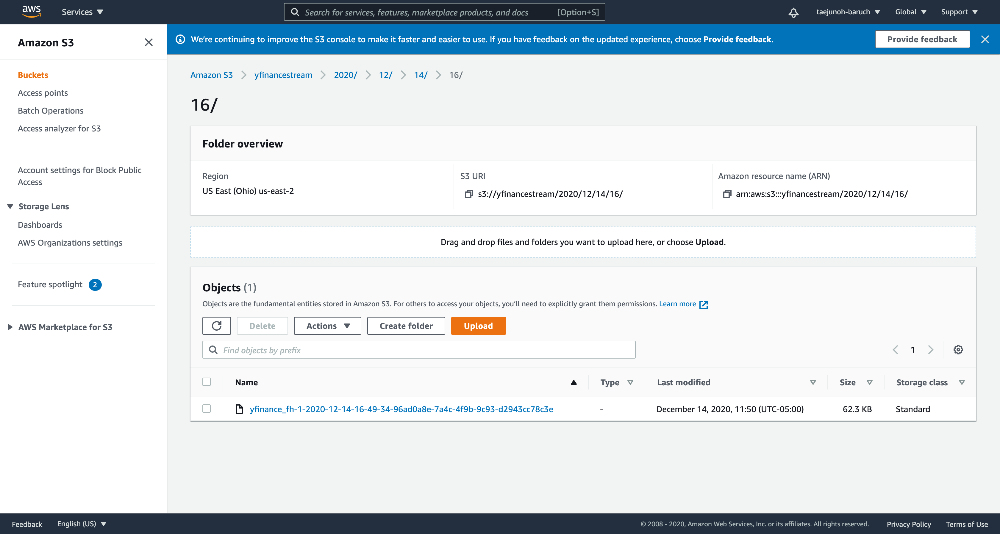

# Streaming Finance Data AWS Lambda

For this project, I provisioned a Lambda function to generate near real-time finance data records for interactive querying.

This project consists of three parts:
- **DataTransformer**; a lambda function that gathers the data
- **DataCollector**; a Kinesis stream that holds the data
- **DataAnalyzer**; a serverless process to query the S3 data

## Data Transformation

In the collector lambda, I grabbed pricing information for each of the following stocks:
> Facebook (FB) 
> Shopify (SHOP)
> Beyond Meat (BYND)
> Netflix (NFLX)
> Pinterest (PINS)
> Square (SQ)
> The Trade Desk (TTD)
> Okta (OKTA)
> Snap (SNAP)
> Datadog (DDOG)

I collected one full day's worth of stock HIGH and LOW prices for each company listed above on Tuesday, December 1st 2020, at a five minute interval.

## Lambda Source Code for DataCollector
You can see the source code for the lambda function in 'data_transformer.py'. It ran for collecting the financial data from [yfinance](https://github.com/ranaroussi/yfinance) and putting into the Kinesis firehose stream.

## AWS Kinesis Configuration

Following is a screenshot of a Monitoring page in the Kinesis data firehose.

## S3 Content From DataCollector

A screenshot below shows the S3 data that my system collected and stored as part of the DataTransformer.

## Data Analysis

I set up a Glue crawler so that I could run AWS Athena query against collected financial data. Then, in Athena, I wrote and run a query in SQL that generated the highest hourly stock price per company from the list above. This query was saved in 'query.sql'. The result was coverted to csv format and saved in 'results.csv'.

## Data Visualizations

Using the result above, I created two data visualizations in Python. You can my code and graphs in 'Analysis.ipynb'

## Next Step

I will collect Amazon's stock price and apply Machine Learning methods to predict a trend of price change in the future.